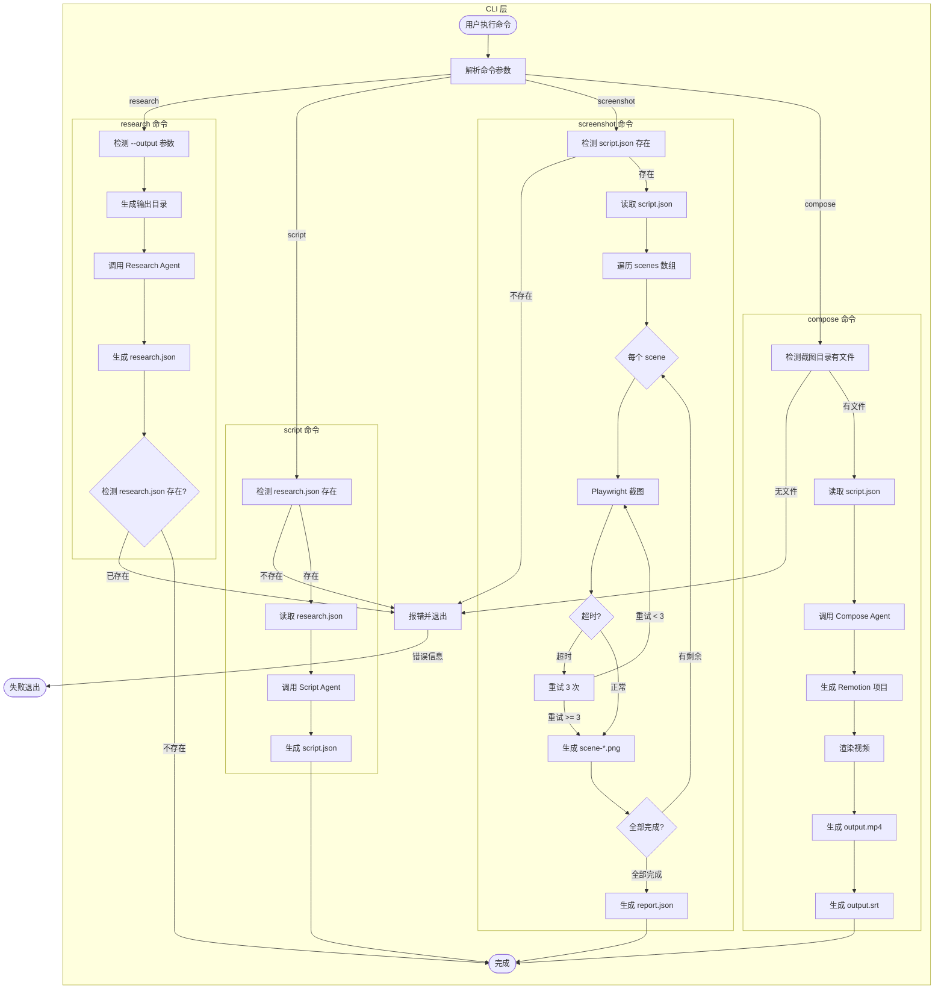

# 实施计划: add-output-directory-structure

## 概述

本计划将 OpenSpec 变更 `add-output-directory-structure` 转化为可执行的实施任务。变更核心是用 4 个手动子命令替换自动 workflow。

## 决策记录

| 盲区 | 决策 | 说明                                     |
| ---- | ---- | ---------------------------------------- |
| 1    | A    | segments 数量默认 20，可通过参数配置     |
| 2    | A    | scenes 数量默认 30，可通过参数配置       |
| 3    | A    | keyContent 直接存储 JSON 对象 (z.record) |
| 4    | B    | 检测到已存在文件则报错退出               |
| 5    | A    | 网络重试全部失败时清理并抛出错误         |
| 6    | A    | 部分截图失败时继续执行，生成 report.json |
| 7    | B    | 命令执行前检测前置文件是否存在           |

### 架构审查决策

| 问题            | 决策 | 说明                             |
| --------------- | ---- | -------------------------------- |
| keyContent 类型 | A    | 使用 JSON 对象 z.record(z.any()) |
| Effect 类型     | A    | 实现全部 10 种 effect            |
| Slug 中文处理   | A    | 使用 pinyin npm 库               |

---

## 1. 数据与接口变更

### 1.1 新增类型定义 (`src/types/index.ts`)

```typescript
// Research 命令输出类型
export const ResearchLinkSchema = z.object({
  url: z.string().url(),
  key: z.string(),
});

export const ResearchSegmentSchema = z.object({
  order: z.number().int().positive(),
  sentence: z.string(),
  keyContent: z.record(z.any()), // JSON 对象
  links: z.array(ResearchLinkSchema),
});

export const ResearchOutputSchema = z.object({
  title: z.string(),
  segments: z.array(ResearchSegmentSchema).max(20), // 决策 1
});

// Script 命令输出类型
export const ScreenshotConfigSchema = z.object({
  background: z.string().default("#1E1E1E"),
  maxLines: z.number().int().positive().default(15),
  width: z.number().int().positive().default(1920),
  fontSize: z.number().int().positive().default(14),
  fontFamily: z.string().default("Fira Code"),
  padding: z.number().int().optional(),
  theme: z.string().optional(),
});

// Effect 联合类型 - 全部 10 种
const CodeHighlightEffectSchema = z.object({
  type: z.literal("codeHighlight"),
  lines: z.array(z.number().int().positive()),
  color: z.string().regex(/^#[0-9A-Fa-f]{6}$/),
  duration: z.number().min(0.1).max(10),
});

const CodeZoomEffectSchema = z.object({
  type: z.literal("codeZoom"),
  scale: z.number().min(0.1).max(5.0),
  anchor: z.array(z.number().min(0).max(1)).length(2),
  duration: z.number().min(0.1).max(10),
});

const CodePanEffectSchema = z.object({
  type: z.literal("codePan"),
  from: z.array(z.number()),
  to: z.array(z.number()),
  duration: z.number().min(0.1).max(10),
});

const CodeTypeEffectSchema = z.object({
  type: z.literal("codeType"),
  speed: z.number().min(1).max(200),
  cursorBlink: z.boolean().optional(),
});

const TextFadeInEffectSchema = z.object({
  type: z.literal("textFadeIn"),
  direction: z.enum(["up", "down", "left", "right"]),
  stagger: z.number().min(0).max(1),
});

const TextSlideInEffectSchema = z.object({
  type: z.literal("textSlideIn"),
  direction: z.enum(["up", "down", "left", "right"]),
  distance: z.number().min(0).max(500),
});

const TextZoomInEffectSchema = z.object({
  type: z.literal("textZoomIn"),
  scale: z.number().min(0.1).max(3.0),
});

const SceneFadeTransitionSchema = z.object({
  type: z.literal("sceneFade"),
  duration: z.number().min(0.1).max(5),
});

const SceneSlideTransitionSchema = z.object({
  type: z.literal("sceneSlide"),
  direction: z.enum(["up", "down", "left", "right"]),
  duration: z.number().min(0.1).max(5),
});

const SceneZoomTransitionSchema = z.object({
  type: z.literal("sceneZoom"),
  fromScale: z.number().min(0.1).max(2.0),
  toScale: z.number().min(0.1).max(2.0),
  anchor: z.array(z.number().min(0).max(1)).length(2),
  duration: z.number().min(0.1).max(5),
});

export const EffectSchema = z.union([
  CodeHighlightEffectSchema,
  CodeZoomEffectSchema,
  CodePanEffectSchema,
  CodeTypeEffectSchema,
  TextFadeInEffectSchema,
  TextSlideInEffectSchema,
  TextZoomInEffectSchema,
]);

export const TransitionSchema = z.union([
  SceneFadeTransitionSchema,
  SceneSlideTransitionSchema,
  SceneZoomTransitionSchema,
]);

export const SceneScriptSchema = z.object({
  order: z.number().int().positive(),
  segmentOrder: z.number().int().positive(),
  type: z.enum(["url", "text"]),
  content: z.string(),
  screenshot: ScreenshotConfigSchema.optional(),
  effects: z.array(EffectSchema).optional(),
});

export const ScriptOutputSchema = z.object({
  title: z.string(),
  scenes: z.array(SceneScriptSchema).max(30), // 决策 2
  transitions: z.array(TransitionSchema).optional(),
});
```

### 1.2 配置文件扩展 (`video-script.config.json`)

```json
{
  "research": {
    "maxSegments": 20
  },
  "script": {
    "maxScenes": 30
  },
  "screenshot": {
    "timeout": 30000,
    "retryCount": 3
  }
}
```

---

## 2. 核心业务逻辑

### 2.1 输出目录生成 (`src/utils/output-directory.ts`)

**输入**: `title: string, basePath?: string`  
**输出**: `string` - 完整目录路径

**规则**:

1. 默认 basePath = `process.cwd()/output/`
2. 周范围计算: ISO 8601 周起始日(周一)
3. 选题 slug: 中文转拼音，特殊字符移除

**算法**:

```
1. 获取当前日期
2. 计算所在周起始日和结束日
3. 格式: {年}/{周-月_日-月_日}_{slug}/
4. slug = pinyin(title).toLowerCase().replace(/[^a-z0-9]/g, '-')
```

### 2.2 CLI 命令前置检测

**规则** (决策 7):

- `script` 命令执行前检测 `research.json` 是否存在
- `screenshot` 命令执行前检测 `script.json` 是否存在
- `compose` 命令执行前检测截图目录是否有文件

### 2.3 幂等性处理 (决策 4)

- 命令执行前检测目标文件是否存在
- 存在则报错退出，提示用户使用 `--force` 或手动删除

### 2.4 错误处理

**网络请求** (决策 5):

- 重试 3 次，指数回退 (2s, 4s, 8s)
- 全部失败后删除已创建目录，抛出错误

**截图部分失败** (决策 6):

- 继续执行成功的截图
- 生成 `screenshot-report.json` 记录失败项

---

## 3. 任务拆解

### Setup 阶段

| ID  | 任务                                 | 依赖 | 验收条件                               |
| --- | ------------------------------------ | ---- | -------------------------------------- |
| S-1 | 创建 `src/types/research.ts`         | -    | 类型定义通过 TypeScript 编译           |
| S-2 | 创建 `src/types/script.ts`           | S-1  | Scene/Effect/Transition 类型完整       |
| S-3 | 创建 `src/utils/output-directory.ts` | -    | 单元测试覆盖周范围计算和 slug 转换     |
| S-4 | 扩展配置文件类型                     | -    | 新增 research/script/screenshot 配置项 |

### Test 阶段

| ID  | 任务                      | 依赖     | 验收条件                         |
| --- | ------------------------- | -------- | -------------------------------- |
| T-1 | output-directory 单元测试 | S-3      | 覆盖标准目录、跨月、周边界等场景 |
| T-2 | 类型定义单元测试          | S-1, S-2 | Zod schema 验证通过              |

### Impl 阶段

| ID  | 任务                              | 依赖               | 验收条件                             |
| --- | --------------------------------- | ------------------ | ------------------------------------ |
| I-1 | 修改 CLI: 移除 create/resume 命令 | -                  | CLI 帮助信息不显示 create/resume     |
| I-2 | 实现 research 子命令              | S-1, S-3           | 生成 research.json 到指定目录        |
| I-3 | 实现 script 子命令                | S-2, S-3, I-2      | 读取 research.json，生成 script.json |
| I-4 | 实现 screenshot 子命令            | S-2, S-3, I-3      | 批量截图，生成 scene-\*.png          |
| I-5 | 实现 compose 子命令               | S-2, S-3, I-4      | 生成 output.mp4 和 output.srt        |
| I-6 | 实现错误处理: 重试机制            | S-4                | 3 次重试后正确失败                   |
| I-7 | 实现前置文件检测                  | I-2, I-3, I-4      | 缺少前置文件时报错                   |
| I-8 | 实现幂等检测                      | I-2, I-3, I-4, I-5 | 存在文件时报错退出                   |

### Integration 阶段

| ID    | 任务             | 依赖    | 验收条件                                  |
| ----- | ---------------- | ------- | ----------------------------------------- |
| INT-1 | 完整流程集成测试 | I-1~I-8 | research→script→screenshot→compose 全链路 |
| INT-2 | 运行 `npm test`  | -       | 所有测试通过                              |
| INT-3 | 类型检查         | -       | `npm run typecheck` 无错误                |

---

## 4. 文件变更清单

### 新增文件

- `src/types/research.ts` - Research 相关类型
- `src/types/script.ts` - Script/Scene/Effect 类型
- `src/utils/output-directory.ts` - 输出目录生成工具
- `src/utils/__tests__/output-directory.test.ts` - 单元测试

### 修改文件

- `src/cli/index.ts` - 替换 create/resume 为 4 个子命令
- `src/types/index.ts` - 移除旧类型，新增类型导出
- `src/utils/config.ts` - 扩展配置类型
- `video-script.config.json` - 新增配置项
- `package.json` - 添加 pinyin 依赖

### 删除文件

- `src/cli/review.ts` - 不再需要 (决策)
- `src/mastra/workflows/video-generation-workflow.ts` - 移除自动 workflow

---

## 5. Mermaid 流程图


